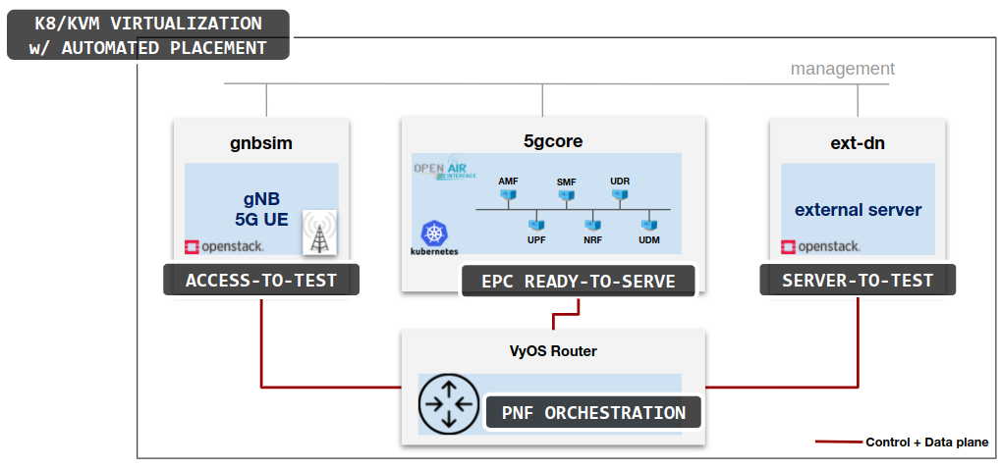
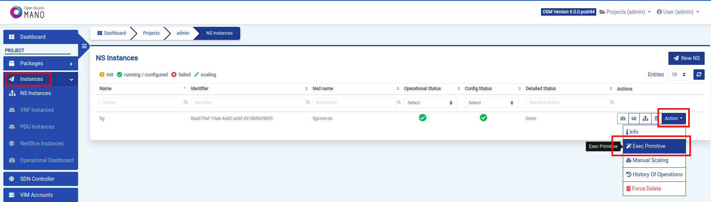
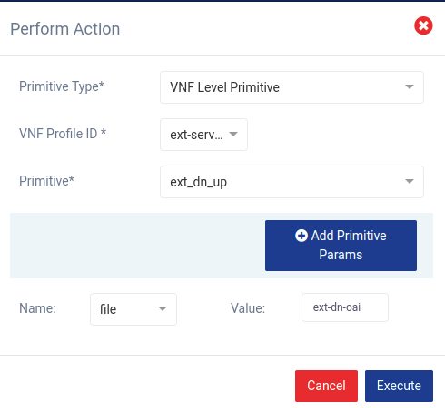
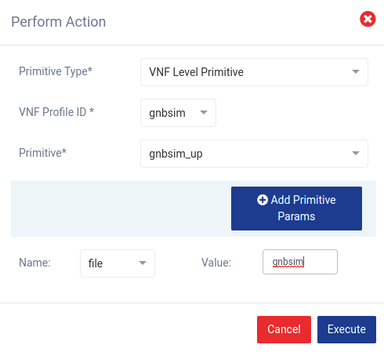

# OAI 5G Core deployment using helm-based EE

This guide is intended to give all the considerations and descriptors needed to deploy a 5G Core, a gnbsim to emulate access (gNB and UE) and a external network to test. This guide also includes a PNF VyOS Router and its configuration to ensure the connectivity between elements in this architecture.

## Architecture

This architecture considers:



- gnbsim: the open source software to emulate gNB and UE, it's used to connect a gNB and register a UE to the 5G Core. In this case we're deploying it as a VNF.
- 5gcore: The open source project created by OAI (Open Air Interface), it deploys the 5G SA core including NF like NRF, AMF, SMF, UDR, UDM, UPF. In this case we're going to deploy it as a CNF.
- ext-dn: this is the external network we're implementing to test the 5G core, it implements an iperf server to test from the UE. In this case we're deploying it as a VNF.

## Preparation

### Infrastructure preparation

#### Openstack 

Two networks should be defined, one for 5gcore and other for communication between access and external-network:

- 5g-core-cp: 192.168.18.0/24 (could be shorter), gateway and port-security in the VMs must be disabled
- 5g-inter-vm: 192.168.1.0/29, gateway and port-security in the VMs must be disabled

#### Kubernetes cluster

Since 5G Core is going to be deployed on a K8s cluster, take note of what you need in your K8s Cluster first:

1. K8s cluster must have multus and macvlan  installed since 5G core needs PODs with two interfaces. 
2. Worker nodes must have one additional interface (ens8) in the network 192.168.18.0/24 (could be shorter), for example worker01 could have 192.168.18.3, worker02 could have 192.168.18.4 and so on.

#### PNF

VyOS Router will provide connectivity. It must have 3 interfaces:

- One should be the default for 5g-core-cp network: 192.168.18.129
- One should be the default for 5g-inter-vm network: 192.168.1.1
- One for management, this depends on the infra and will be used to connect from OSM.

You could use the infra.sh script to create PDU in OSM. You also have the pdu.yaml file, make sure to put there the management IP you have for your VyOS VM. Specific configuration for this deployment will be performed from OSM later.

## Launching the network service (NS)

Make sure that VNF/KNF packages are already onboarded in OSM (osm nfpkg-list), if not, you can create them:
```
osm nfpkg-create gnbsim_vnf
osm nfpkg-create ext-dn_vnf
osm nfpkg-create oai_knf
osm nfpkg-create vyos_ns
```
Make sure that NS package is already onboarded in OSM (osm nspkg-list), if not, you can create it:
```
osm nspkg-create 5gcore_ns
```
Then you have the 5g_core.yaml file which passes additional configuration to the NS, in this case:

- ssh_keys: this ssh key is of the server we'll be using to ssh to the VNF gnbsim and ext-dn. Another option is using cloud-init to set a password.
- k8s-namespace: a specific namespace is used to deploy the 5G Core in K8s cluster.
- vimAccountId: a different VIM is used to deploy gnbsim and ext-server.
```
ssh_keys:
- ssh-rsa AAAAB3NzaC1yc2EAAAADAQABAAABAQDrcvnKVl3o2cN7YFmajQ2RqGGRVgL0OhdkQCXpehJSL/7rxD0rURlUCipqAvqzDQ0UvfPDxWKOJSxhZRY0SCOlb4W6WNBW7hTE31AjS0YtH/JUimc99567y3F1937sy3nzt4yAlIAoI3y7ZZKJI4EP29A47TZ2WbAuQhI/TsDbJmNpXLB0XtBvzTMJuPffwJep0nWp2nYyv21NBBk5rQF6yTi2dDJ3DwcatfaIv5o0UeI07mbyEmxV2hVrIxPKv3KG65dBvbvF+sjdFMp0tJUfqDn/FJso+jqlwmmvrtk+8bmhL7vzzMyUXyfCjUV2G+u0GOPjl3Q+rnxjCsl2yEib
k8s-namespace: oai
vnf:
- member-vnf-index: gnbsim
  vimAccountId: b0fe741c-37d9-4f42-bce7-b163122a9790
- member-vnf-index: ext-server
  vimAccountId: 74c9e008-28ce-45c4-9634-9aec3177fb76
```
The command to instantiate this NS is:
```
osm ns-create --ns_name 5g --nsd_name 5gcore-ns --vim_account whitecloud --config_file 5g_params.yaml
```

## Starting services from OSM

Since Helm-based EE is used to create primitives for day-1 and day-2, we're going to use the GUI to start external server and gnbsim services:

### Starting external server service

First log in OSM and find the NS created, then click in "Action" and click in "Exec Primitive" 



In the opened window select "VNF Level Primitive", "ext-server", "ext_dn_up", "file" and type "ext-dn-oai", then click in Execute:



### Starting gnbsim service

First log in OSM and find the NS created, then click in "Action" and click in "Exec Primitive" 


In the opened window select "VNF Level Primitive", "gnbsim", "gnbsim_up", "file" and type "gnbsim", then click in Execute:



With these two primitives executed we're ready to test traffic.

## Testing traffic

1. Using management IP assigned to the external server proceed to ssh to the instance (remember to do it from the server you have copied the ssh keys)
2. Execute the iperf command:
    ```
    docker exec -ti oai-ext-dn iperf3 -s
    ```  
3. Using the management IP assigned to gnbsim proceed to ssh to the instance (remember to do it from the server you have copied the ssh keys)
    ```
    docker exec -ti gnbsim iperf3 -c 192.168.70.135 -B 12.1.1.2
    ```
4. You should be able to see traffic going from gnbsim to external server passing through 5G Core.